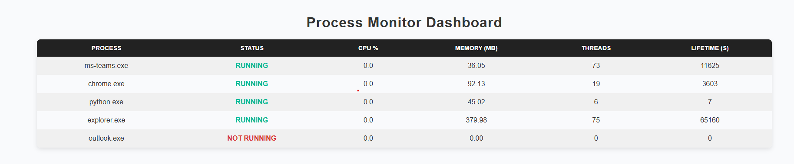

# Process Monitor



A lightweight FastAPI-based application to monitor specific system processes and display their status in a simple web dashboard.

## Features
- Monitors configured processes using `psutil`
- Displays a clean, color-coded HTML dashboard at `/dashboard`
- API endpoints to dynamically add or remove monitored processes at runtime
- Runs entirely from a single Python file (`server.py`)

## Requirements
- Python 3.8+

## Installation
Install all dependencies using `pip`:
```bash
pip install -r requirements.txt
```

## Configuration
Define the processes you want to monitor in a `config.json` file in the same directory as `app.py`. Example:

- `sampling_interval`: time in seconds between checks.
- `processes`: list of process names to monitor (case-insensitive).


**Note** The processes list must match the actual process names as they appear on the target os.
 

##### on Linux/macOS, process names do not include .exe (e.g., chrome, python).
```json
{
  "sampling_interval": 5,
  "processes": ["chrome", "teams", "python"]
}
```

##### on Windows, process names usually include .exe (e.g., chrome.exe, python.exe).
```json
{
  "sampling_interval": 5,
  "processes": ["chrome.exe", "teams.exe", "python.exe"]
}
```

## How to run:

### Run Locally:
```bash
python server.py
```

### Run with Docker:

#### Build the Docker image:

```
docker build -t process-monitor .
```

#### Docker run :

```
docker run -p 8000:8000 -v /path/to/your/config.json:/app/config.json process-monitor

```

Then open your browser at:

http://127.0.0.1:8000/dashboard


## API Endpoints

### add_process Example:
Adds a new process to the list of monitored processes.
```
curl -X POST http://127.0.0.1:8000/add_process \
  -H "Content-Type: application/json" \
  -d '{"name": "chrome"}'
```
### delete_process Example:
Removes a process from the list of monitored processes.
```
curl -X DELETE http://127.0.0.1:8000/delete_process \
  -H "Content-Type: application/json" \
  -d '{"name": "chrome"}'
```

