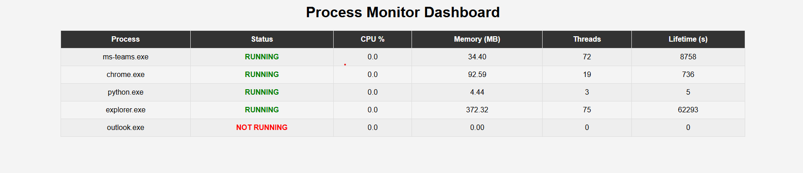

# Process Monitor



A lightweight FastAPI-based application to monitor specific system processes and display their status in a simple web dashboard.

## Features
- Monitors configured processes using `psutil`
- Displays a clean, color-coded HTML dashboard at `/dashboard`
- API endpoints to dynamically add or remove monitored processes at runtime
- Runs entirely from a single Python file (`server.py`)

## Requirements
- Python 3.8+

## Installation
Install all dependencies using `pip`:
```bash
pip install -r requirements.txt


## Configuration
Define the processes you want to monitor in a `config.json` file in the same directory as `app.py`. Example:
```json
{
  "sampling_interval": 5,
  "processes": ["chrome", "teams", "python"]
}
```

- `sampling_interval`: time in seconds between checks.
- `processes`: list of process names to monitor (case-insensitive).

## How to run
Run the server:
```bash
python server.py
```

Then open your browser at:
```
http://127.0.0.1:8000/dashboard
```

## API Endpoints

### Add process Example:
```
curl -X POST http://127.0.0.1:8000/add_process \
  -H "Content-Type: application/json" \
  -d '{"name": "chrome"}'
```
### Delete process Example:

```
curl -X DELETE http://127.0.0.1:8000/delete_process \
  -H "Content-Type: application/json" \
  -d '{"name": "chrome"}'
```

